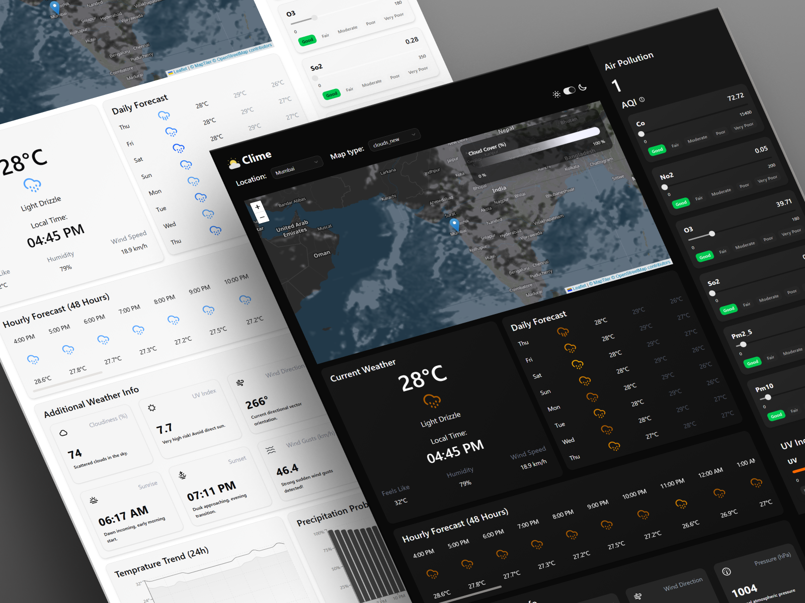
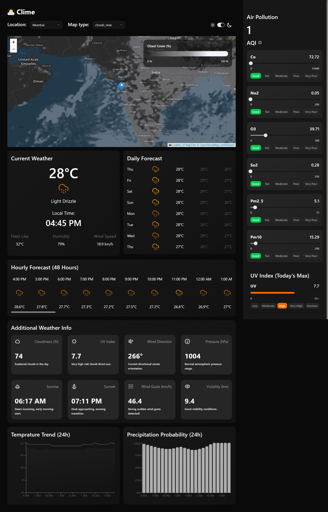
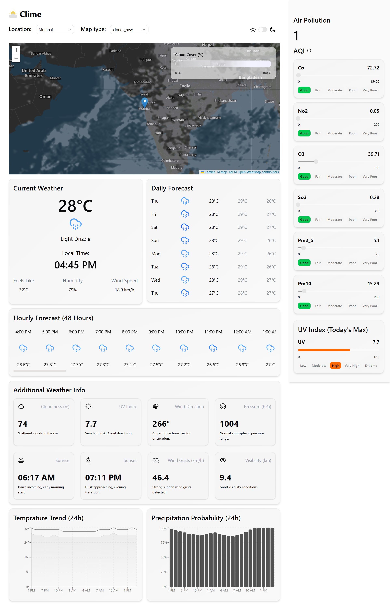
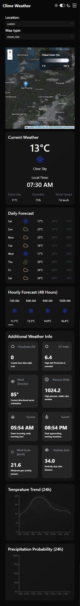

# Clime Weather Insights

> A production-oriented weather intelligence dashboard for exploring real-time weather, forecasts, air quality, and geospatial weather data through a responsive, data-rich interface.

 

>Clime Weather Insights is a weather intelligence dashboard designed to give users a complete picture of their local atmospheric conditions from a single interface. The goal is to move beyond the traditional “temperature + weather icon” experience by combining current conditions, short- and long-term forecasts, air-quality measurements, pollutant breakdowns, UV exposure, interactive weather layers, and visual trends into one cohesive experience. By bringing these different data points together, Clime helps users quickly understand what the weather is like now, how it is expected to change, and what other environmental conditions may matter alongside the forecast.


**Live Demo:** `https://clime-weather-insights.vercel.app/`

**Repository:** `https://github.com/samarjeets10/Clime-Weather-Insights`

---

## Overview

Clime Weather Insights is a React-based weather intelligence dashboard designed to bring multiple weather data sources into a single, information-dense interface.

Instead of presenting only current temperature and weather conditions, the application combines:

* Real-time weather conditions
* 48-hour hourly forecasting
* 8-day daily forecasting
* Air Quality Index and pollutant analysis
* UV index information
* Interactive geospatial weather layers
* Temperature and precipitation visualizations
* Location search and map-based location selection
* Responsive layouts across mobile, tablet, and desktop
* Persistent light/dark theme support

The project focuses on building a **real-world data-driven frontend**, with particular emphasis on asynchronous data fetching, runtime validation, loading states, responsive information architecture, and reusable React components.

---

## Why This Project?

Weather applications are a useful frontend engineering problem because they combine several challenges that appear in production applications:

* Multiple external APIs
* Different response structures
* Asynchronous and dependent data
* Frequently changing data
* Runtime validation
* Data visualization
* Geospatial interaction
* Responsive information-dense layouts
* Loading and error states
* Client-side environment configuration

Clime Weather Insights was built to explore these challenges using modern React patterns rather than treating the application as a simple API-fetching project.

---

## Key Features

### Weather Intelligence

* **Current Weather**

  * Temperature
  * Feels-like temperature
  * Humidity
  * Wind speed and direction
  * Wind gusts
  * Visibility
  * Atmospheric pressure
  * Cloud coverage
  * Sunrise and sunset
  * Local timezone-aware time

* **48-Hour Forecast**

  * Hour-by-hour temperature
  * Weather conditions
  * Precipitation probability
  * Scrollable forecast interface

* **8-Day Forecast**

  * Daily maximum/minimum temperatures
  * Average temperature
  * Weather conditions
  * Daily weather icons

### Air Quality Monitoring

The dashboard integrates OpenWeather's Air Pollution API to provide:

* Overall AQI classification
* Individual pollutant concentrations
* CO
* NO₂
* O₃
* SO₂
* PM2.5
* PM10
* Pollutant-specific quality ranges
* Visual pollutant indicators

AQI and pollutant values are transformed into user-friendly quality categories instead of exposing raw API values directly.

### Interactive Weather Map

The map combines Leaflet, MapTiler, and OpenWeather weather tiles.

Supported overlays include:

* Clouds
* Precipitation
* Pressure
* Wind
* Temperature

Additional map functionality includes:

* Click-to-select coordinates
* Location-aware map navigation
* Smooth pan-to-location behavior
* Dynamic legends based on the selected weather layer
* Dark-themed base map

### Location Search

Users can discover locations through:

* Preset popular cities
* Geocoding-based city search
* Direct map interaction
* Latitude/longitude selection

Open-Meteo's geocoding service is used for converting location names into coordinates.

### Data Visualization

The dashboard uses Recharts to visualize forecast data through:

* 24-hour temperature trends
* Actual vs. feels-like temperature
* Precipitation probability

Charts are integrated with the application's light/dark theme.

### Responsive UX

The interface is designed around different screen sizes rather than simply scaling a desktop layout down.

Implemented responsive behaviors include:

* Mobile-specific navigation
* Collapsible air-quality panel
* Responsive dashboard grid
* Horizontally scrollable forecast cards
* Adaptive map layout
* Tablet and desktop-specific spacing
* Ultra-wide layout support

### UI & Accessibility

* Light/dark theme with `localStorage` persistence
* Skeleton loading states
* Contextual tooltips
* Reusable UI primitives
* Custom scrollbar styling
* Consistent iconography
* Component-based dashboard architecture

---

## Technical Architecture

The application follows a component-driven frontend architecture with clear separation between UI, API communication, validation, and utility logic.

```text
                    ┌─────────────────────┐
                    │     React App       │
                    │      App.jsx        │
                    └──────────┬──────────┘
                               │
                ┌──────────────┼──────────────┐
                │              │              │
                ▼              ▼              ▼
          UI Components    React Context   TanStack Query
                │              │              │
                │              │              ▼
                │              │         API Layer
                │              │              │
                ▼              ▼              ▼
          Weather Cards    Theme State    External APIs
          Charts           UI State       ├─ Open-Meteo
          Map                              ├─ OpenWeather
          Air Quality                      └─ MapTiler
                │
                ▼
          Zod Validation
                │
                ▼
        Validated Application Data
```

### Data Flow

```text
User selects location
        ↓
Geocoding API
        ↓
Latitude / Longitude
        ↓
TanStack Query
        ↓
Weather / AQI API requests
        ↓
Zod runtime validation
        ↓
Normalized application data
        ↓
React components
        ↓
Cards / Charts / Map / AQI
```

This structure keeps API communication separate from presentation components and provides a consistent boundary for validating external data.

---

## Engineering Highlights

### Server-State Management

TanStack Query is used for asynchronous server-state management.

The application uses `useSuspenseQuery` to coordinate data fetching with React Suspense, allowing individual dashboard sections to define their own loading boundaries.

Benefits include:

* Request caching
* Automatic request lifecycle management
* Declarative data fetching
* Reduced manual loading-state management
* Better separation between server state and UI state

### Runtime API Validation

External APIs are treated as untrusted input.

Zod schemas validate API responses before the data reaches the UI layer.

```text
External API
     ↓
Raw JSON
     ↓
Zod Schema
     ↓
Validated Data
     ↓
React Components
```

This prevents unexpected API response shapes from silently propagating through the application.

### Component-Based Architecture

The UI is divided into focused components rather than placing dashboard logic inside a single large component.

Examples include:

* Current weather
* Hourly forecast
* Daily forecast
* Additional weather information
* Air pollution
* Weather map
* Charts
* Location selectors
* Skeleton states
* Side panel
* Theme controls

This makes individual dashboard sections easier to maintain and evolve independently.

### Loading UX

Instead of rendering an empty dashboard while requests are pending, the application uses skeleton components with React Suspense.

This creates predictable loading behavior for individual sections and avoids large blank areas during API requests.

### Responsive Information Architecture

Because weather dashboards contain large amounts of information, responsiveness is handled at the layout level.

The desktop interface prioritizes simultaneous visibility of weather cards, charts, map data, and air-quality information, while mobile layouts reorganize these sections into a more focused vertical flow.

---

## Technology Stack

| Layer         | Technology        | Purpose                              |
| ------------- | ----------------- | ------------------------------------ |
| Frontend      | React 19          | Component-based UI                   |
| Build Tool    | Vite 7            | Development and production builds    |
| Styling       | Tailwind CSS v4   | Responsive styling and design system |
| Server State  | TanStack Query v5 | Data fetching and caching            |
| Validation    | Zod               | Runtime API response validation      |
| Charts        | Recharts          | Weather data visualization           |
| Mapping       | React Leaflet     | React map integration                |
| Map Engine    | Leaflet           | Interactive maps                     |
| Map Tiles     | MapTiler          | Base map rendering                   |
| Weather Tiles | OpenWeather       | Weather overlay layers               |
| UI            | shadcn/ui         | Reusable UI primitives               |
| UI Primitives | Base UI           | Tooltip and slider interactions      |
| Icons         | Lucide React      | Interface iconography                |
| Deployment    | Vercel            | Production deployment                |

---

## External APIs

| Provider    | Service           | Purpose                           | API Key |
| ----------- | ----------------- | --------------------------------- | ------- |
| Open-Meteo  | Forecast API      | Current, hourly and daily weather | No      |
| Open-Meteo  | Geocoding API     | Location → coordinates            | No      |
| OpenWeather | Air Pollution API | AQI and pollutant data            | Yes     |
| OpenWeather | Weather Maps      | Weather overlay tiles             | Yes     |
| MapTiler    | Map Tiles         | Interactive base map              | Yes     |

### Why Multiple Weather Providers?

The application intentionally uses different providers based on the capabilities required.

**Open-Meteo** provides the core forecast and geocoding functionality without requiring an API key.

**OpenWeather** is used for capabilities that complement the forecast data, specifically air pollution measurements and pre-rendered weather map layers.

**MapTiler** provides the base map layer for the interactive geographic interface.

This separation allows each API to be used for the capability it provides best rather than forcing the entire application around a single provider.

---

## Project Structure

```text
src/
├── assets/
│   └── static assets and SVGs
│
├── components/
│   ├── cards/
│   │   ├── CurrentWeather
│   │   ├── HourlyForecast
│   │   ├── DailyForecast
│   │   ├── AdditionalInfo
│   │   └── Map
│   │
│   ├── charts/
│   │   ├── TemperatureChart
│   │   └── PrecipitationChart
│   │
│   ├── dropdowns/
│   │   ├── LocationDropdown
│   │   └── MapTypeDropdown
│   │
│   ├── skeletons/
│   │   └── dashboard loading states
│   │
│   ├── ui/
│   │   └── reusable UI primitives
│   │
│   ├── AirPollution.jsx
│   ├── MobileHeader.jsx
│   ├── SidePanel.jsx
│   └── LightDarkToggle.jsx
│
├── context/
│   └── ThemeContext.jsx
│
├── schemas/
│   └── weatherSchemas.js
│
├── utils/
│   ├── WeatherIcons.jsx
│   ├── airQualityRanges.js
│   └── uvRanges.js
│
├── api.js
├── App.jsx
├── main.jsx
└── index.css
```

---

## Getting Started

### Prerequisites

* Node.js 18+
* npm
* OpenWeather API key
* MapTiler API key

### Installation

```bash
git clone https://github.com/your-username/clime-weather-insights.git

cd clime-weather-insights

npm install
```

Create a `.env` file in the project root:

```env
VITE_API_KEY=your_openweather_api_key
VITE_MAPTILE_API_KEY=your_maptiler_api_key
```

Start the development server:

```bash
npm run dev
```

The application will be available at:

```text
http://localhost:5173
```

---

## Environment Variables

| Variable               | Description                                                     |
| ---------------------- | --------------------------------------------------------------- |
| `VITE_API_KEY`         | OpenWeather API key for air-quality data and weather map layers |
| `VITE_MAPTILE_API_KEY` | MapTiler API key for base map tiles                             |

> **Important:** Vite exposes `VITE_*` variables to the client bundle. These values should therefore be treated as client-side configuration, not as server-side secrets.

For production deployments, configure the variables in the hosting provider's environment settings and trigger a new build.

---

## Available Scripts

```bash
npm run dev
```

Starts the development server with hot module replacement.

```bash
npm run build
```

Creates an optimized production build.

```bash
npm run preview
```

Serves the production build locally for verification.

```bash
npm run lint
```

Runs ESLint against the project.

---

## Production Deployment

The application is deployed using Vercel.

### Deployment Flow

```text
GitHub Repository
       ↓
     Vercel
       ↓
Environment Variables
       ↓
Production Build
       ↓
Live Application
```

### Deployment Checklist

Before deploying:

* Add required environment variables
* Verify API keys
* Run `npm run lint`
* Run `npm run build`
* Verify API requests use HTTPS
* Test responsive layouts
* Test map layers
* Test the application without cached development data

---

## Current Limitations

The current version intentionally has a few limitations:

* Severe weather alerts are not currently implemented.
* Air-quality data requires an OpenWeather API key.
* Weather map overlays require an OpenWeather API key.
* Road/black-ice risk data is not currently included.
* Forecast history and historical comparison are not currently available.
* User accounts and cloud-synced saved locations are not implemented.

---

## Roadmap

Planned improvements include:

* [ ] Severe weather alert integration
* [ ] Historical weather comparison
* [ ] Celsius/Fahrenheit unit switching
* [ ] km/h and mph wind-speed units
* [ ] Saved/favorite locations
* [ ] Persistent user preferences
* [ ] PWA support
* [ ] Offline access to recently fetched data
* [ ] Improved error boundaries and API failure states
* [ ] Automated testing for API schemas and critical UI components

---

## Screenshots

Add production screenshots here to demonstrate the major application states.



---



---




Recommended showcase:

```text
screenshots/
├── dashboard-dark.png
├── dashboard-light.png
├── mobile-dashboard.png
├── air-quality.png
└── weather-map.png
```

Example:

### Dashboard — Dark Mode

### Dashboard — Light Mode

### Mobile Dashboard

### Weather Map

---

## What I Learned

Building Clime Weather Insights involved working with several production-oriented frontend concepts:

* Designing responsive layouts for information-dense interfaces
* Managing asynchronous server state with TanStack Query
* Integrating multiple external APIs
* Validating external data at runtime using Zod
* Building interactive maps with Leaflet
* Working with weather tile layers and geographic coordinates
* Creating reusable React components
* Designing loading states with React Suspense
* Handling client-side environment configuration
* Building responsive data visualizations
* Structuring a scalable React project

The project also provided practical experience dealing with real API constraints, inconsistent data requirements, environment configuration, and the UX challenges of presenting large amounts of real-time information.

---

## Acknowledgments

* [Open-Meteo](https://open-meteo.com/) — weather forecasting and geocoding
* [OpenWeather](https://openweathermap.org/) — air pollution and weather map layers
* [MapTiler](https://www.maptiler.com/) — map tiles
* [shadcn/ui](https://ui.shadcn.com/) — UI primitives
* [Base UI](https://base-ui.com/) — accessible UI primitives
* [Lucide](https://lucide.dev/) — icons
* [Recharts](https://recharts.org/) — data visualization

---

## License

This project is licensed under the MIT License.

See [`LICENSE`](./LICENSE) for details.

---

## Author

**Samar**

* GitHub: `https://github.com/samarjeets10`
<!-- * Portfolio: `https://your-portfolio.com` -->
* Email: `samarsabale1021@gmail.com`

---

<p align="center">
  Built with React, APIs, maps, and a lot of debugging.
</p>
